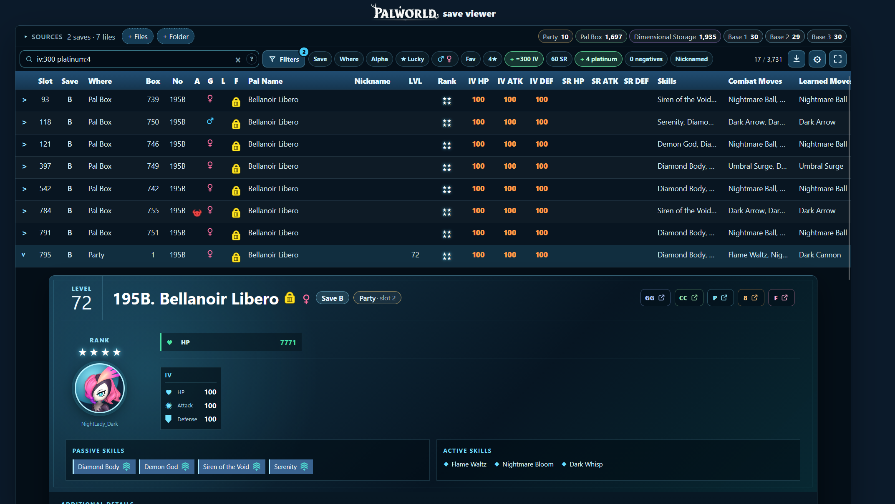
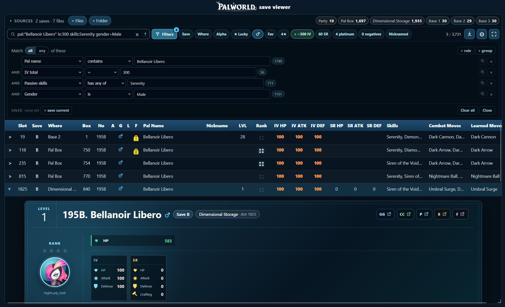
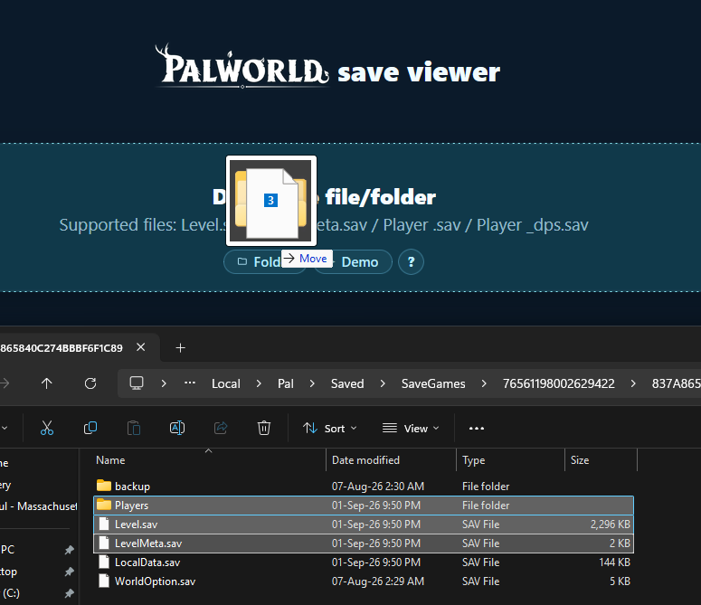

# Palworld Save Viewer

A local viewer for your Palworld save files that lists every Pal you own with all their stats in one searchable table.

Drop a save file/folder to see all owned Pals: party Pals, Pal Box, base Pals, and dimensional storage.

# BROWSER VERSION:

## [https://master3243.github.io/palworld_save_viewer/](https://master3243.github.io/palworld_save_viewer/)

## Example

Example of searching my save for Pals with perfect IVs and 4 diamond active skills:



Example of searching my save for Male Bellanoir with perfect IVs and Serenity (for breeding):



## How do I use it?

Simply open the link, click the "demo" then "Load" buttons to load my personal save file. Now you'll see all the Pals I have with detailed stats and support for arbitrarily complex search filters (even across multiple save files).

If you want to actually use it (not just a demo), drop your save file/folder to see all the Pals with their stats.

For Steam users, the save folder is located at:

```
%LOCALAPPDATA%\Pal\Saved\SaveGames\IDprofile\IDworld\
```

Where `IDprofile` and `IDworld` are long random numbers. Inside it, `Level.sav` holds all Pal info (other than the dimensional storage), `Players\xxx_dps.sav` is the dimensional storage Pals, and `Players\xxx.sav` tiny metadata mapping container to either the player's party or Pal Box (mostly can be inferred and not needed).

For best results, drop these three items: the "Level.sav" file, "LevelMeta.sav" file, and the "Players" folder (contains 2 files).



## Can you fix X bug or implement Y feature?

The project is open source here. Open an issue there and I will take a look. It also helps to include the save file that shows the bug/feature (if the my demo save file does not already do so).

## Will this steal my save data?

No, that's impossible. The website runs completely inside your browser and there is no backend (check the network traffic yourself).

The codebase is open source here. It is hosted on GitHub Pages, which can only serve static websites that run entirely in your browser.

## Will this corrupt my save file?

No, that's impossible. The browser can only read files, it can't edit/write files.

The tool is read-only, you can download a .csv if you want a local csv copy of what the website shows.

## Can I contribute a bug fix or a new feature?

The project is open source here and I welcome fixes and features (please no AI slop).

## Can I donate?

No. Donate to a charity instead.

I only created this tool for my own use, but I was told it was useful, so now it is public.

## Why did you make this?

I was extremely frustrated with the in-game search lacking many criteria I needed, and I also wanted to search across multiple save files at once so I made this tool.

I reached a tipping point when I was farming a specific endgame party with perfect stats, accidentally sent a perfect Pal to the dimensional storage, and then wasted an hour going insane trying to find it (never again...)

It also literally took less time to make the first version of this tool than it took to find that one Pal.

## Resources Used

Resources used while building the save decoder

- [palworld-plm-tools](https://github.com/DYSCreations/palworld-plm-tools)
  - Used as a reference for the Palworld `PlM1` save wrapper and Oodle-compressed `GVAS` payload shape.
- [Palworld Server Manager active skills data](https://github.com/amantu-qbit/palworld-server-manager/blob/main/bridge/data/)
  - `active_skills.json` to map internal combat move IDs to readable names and `passive_skills.json` to map internal passive skill IDs to in-game display names.
- [AdminCommands Pal data](https://github.com/dkoz/AdminCommands/blob/main/AdminCommands/Scripts/enums/paldata.lua)
  - Map internal Pal species IDs to in-game Pal names.
- [PalScouter passive ranks](https://github.com/tanguyannequin-dev/mod-palworld/blob/main/PalScouter/Scripts/passive_ranks.lua)
  - Map passive skill IDs to fixed rank/color tiers.
- [palworld-save-pal game data](https://github.com/oMaN-Rod/palworld-save-pal/tree/main/data/json)
  - Master lists for the 100% Tracker.
- [PalWorldSaveTools game data](https://github.com/deafdudecomputers/PalWorldSaveTools/tree/main/resources/game_data)
  - Some side lists for the 100% Tracker.
- [Palworld-Pal-Editor skin data](https://github.com/KrisCris/Palworld-Pal-Editor/tree/develop/src/palworld_pal_editor/assets/data)
  - Pal skin list for the 100% Tracker.
- [paldb.cc map data](https://paldb.cc/en/Map)
  - Map location data for the 100% Tracker.
- [paldb.cc icon CDN](https://cdn.paldb.cc/image/Pal/Texture/UI/InGame/)
  - Element type and work suitability icons (`T_Icon_element_s_*`, `T_icon_palwork_*`), saved under `pal-storage-viewer/public/assets/icons/`. Per-species elements and base work levels come from the palworld-save-pal pal table via `build_completion_data.py` (`resources/pal_traits_lookup.json`).


## Save files supported

Dropping a whole world save folder onto the viewer provides the most complete view as it automatically decodes all relevant files (everything is decoded in the browser, nothing is uploaded).


| File                               | Contains Pals  | What it contributes                                                                                       |
| ---------------------------------- | -------------- | ----------------------------------------------------------------------------------------------------------|
| `Level.sav`                        | yes            | Data for every Pal (minus the dimensional storage)                                                        |
| `Players/<uid>_dps.sav`            | yes            | Dimensional Pal Storage (up to 9,600 Pals)                                                                |
| `Players/<uid>.sav`                | no             | Metadata mapping container to either the player's party or Pal Box (mostly can be inferred and not needed)|
| `LevelMeta.sav`                    | no             | Metadata used to label the save                                                                           |
| `LocalData.sav`, `WorldOption.sav` | no             | Skipped, contain no useful info for us                                                                    |


Files from different worlds can be loaded side by side and the table will show which save file each Pal belongs to.